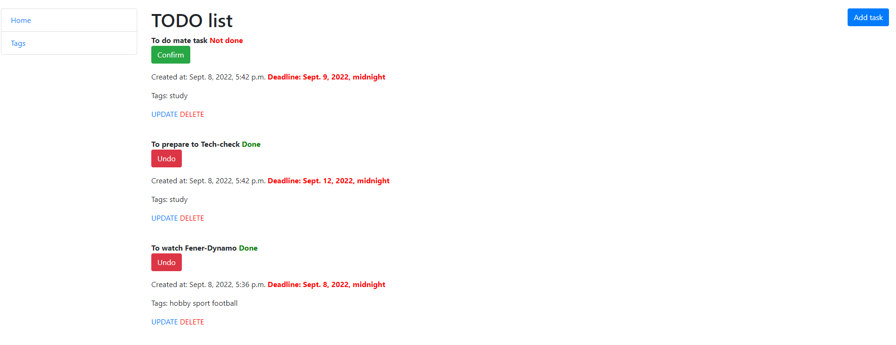

# TODO List Project

Django project for managing tasks and tags in TODO list


## Installation

Python3 must be already installed

```shell
git clone https://github.com/DHushchyk/Todo-list.git
cd library
python3 -m venv venv
source venv\Scripts\activate (on Windows)
source venv\bin\activate (on Mac)
pip install -r requirements.txt
python manage.py migrate
python manage.py runserver
```

## Features

* Authentication functionality for Admin
* Managing tasks and tags directory from website
* Powerful admin panel for advanced managing


## Demo

